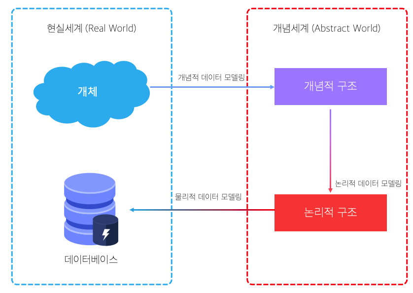

# 모델링의 이해

## 모델링

### 정의

현실세계에 있는 사람, 사물, 개념 등 다양한 현상을 표기법에 의해 규칙을 가지고 표기하는 것이다.  
이때 변환 과정에서 `추상화(모형화)`, `단순화`, `명확화`를 거쳐 변환된다.

### 특징

**추상화**
현실세계를 일정한 형식에 맞추어 표현 한다는 의미, 다양한 현상을 정해진 양식으로 표기해야하는 것을 의미 함  
**단순화**
복잡한 현실세계의 규칙을 제한된 표기법으로 변환하여 표기해야하는 것을 의미 함  
**명확화**
누구나 이해하기 쉽게 하기 위해 애매모함을 없애고 정확하게 현상을 기술하는것을 의미 함

### 3가지 관점

모델링에는 `데이터관점(Data, What)`, `프로세스관점(Process, How)`, `상관관점(Data vs Process)` 3가지의 관점이 있다.

#### 데이터관점 (Data, What)

업무가 어떤 데이터와 관련이 있는지 또는 데이터간의 관계는 무엇인지에 대해서 모델링하는 방법

#### 프로세스관점 (Process, How)

업무가 실제하고 있는 일은 무엇인지 또는 무엇을 해야하는지를 모델링 하는 방법

#### 데이터와 프로세스의 상관관점 (Data vs Process, Interaction)

업무가 처리하는 일의 방법에 따라 데이터는 어떻게 영향을 받고 있는지 모델링하는 방법

# 데이터 모델의 이해

## 데이터 모델링의 정의

데이터 모델은 데이터베이스의 골격을 이해하고 그 이해를 바탕으로 SQL 작성을 기능과 성능적인 측면에서 효율적으로 작성하기 위해 꼭 알고 가야하는 핵심 요소이다.

- 정보시스템을 구축하기 위해, 해당 업무에 어떤 데이터가 존재하는지 또는 업무가 필요로 하는 정보는 무엇인지를 분석하는 방법
- 업무에 대한 종합적인 이해를 바탕으로 데이터에 존재하는 `업무규칙(Business Rule)`에 대하여 참과 거짓을 판별할 수 있는 `사실(명제)`을 데이터에 접근하는 `방법`, `사람`, `전산화`와는 **독립적인 관점에서 이를 명확하게 표현하는 추상화 기법**

## 데이터 모델링의 기능

데이터 모델링은 아래 6가지의 기능을 제공한다.

- 시스템의 가시화
- 시스템의 구조, 행동에 대한 명세화
- 시스템 구축에 필요한 구조화된 틀(Frame) 제공
- 시스템 구축의 과정에서 나온 결정의 문서화
- 다양한 영역에 집중하기 위해 다른 영역의 세부 사항은 숨길 수 있도록 제공
- 특정 목표에 따라 구체화된 상세 수준의 표현 방법을 제공

# 데이터 모델링의 중요성 및 유의점

## 데이터 모델링의 중요성

중요성은 `파급효과(Leverage)`, `간결한 표현(Conciseness)`, `데이터 품질(Data Quality)` 3가지로 정리 된다.

### 파급효과(Leverage)

시스템 구축이 완료되어 단위 테스트를 통과하고 병행 테스트, 통합 테스트를 진행한다고 했을 때 마지막 통합 테스트에서 데이터 모델의 변경이 불가피 하게 된 상황이 오게 되었다고 가정해보자. 하나의 데이터 구조 변경을 위해서 표준 영향 분석, 응용 변경 영향 분석 등 다양한 영향 분석이 일어난다. 이러한 점을 보았을 때, **데이터 구조의 변경으로 인해 다양한 파급효과가 발생하게 된다는 것을 알 수 있다.** 이러한 파급효과를 줄이기 위해서라도 시스템 구축 설계 작업 중 제일 세심하게 다루고 중요하게 생각 해야하는 것이 데이터 설계이다.

### 간결한 표현(Conciseness)

데이터 모델은 시스템의 요구사항과 한계를 가장 명확하고 간결하게 표현할 수 있는 도구이다. 요구사항을 파악하기 가장 좋은 방법은 수 많은 페이지를 파악하는 것보다 간결하게 그려져 있는 데이터 모델을 리뷰하면서 파악하는 것이 빠르다.

### 데이터 품질(Data Quality)

데이터베이스에 담겨있는 데이터는 중요한 자산이다. 데이터베이스의 데이터들은 오래될 수록 값이 올라가는 반면 정확성이 떨어지거나 필요가 없는 데이터라면 비즈니스의 기회를 잃어버릴 수 도 있는 크나큰 문제점을 야기할 수 있다. 그렇기에 오랜 기간 저장될 수 있는 데이터의 품질을 높이기 위해서 세심한 데이터 모델링이 정말 중요하다.

## 데이터 모델링의 유의점

데이터 품질의 문제가 야기되는 이유 중 하나가 데이터 구조의 문제이다. 데이터 품질을 저하하는 요소로는 `중복(Duplication)`, `비유연성(Inflexibility)`, `비일관성(Inconsistency)`으로 3가지 정도로 정의할 수 있다.

### 중복(Duplication)

<s>데이터 모델은 같은 데이터를 사용하는 사람, 시간, 장소 등 도움을 준다. 이러한 정보들은 여러 장소에 같은 정보를 저장하는 잘못을 하지않도록한다.</s> (책에 적혀있기론 이렇게 적혀있지만 말이 안맞는 이야기 같아 재해석 합니다.)  
데이터 모델을 정의할 때에는 다양한 정보를 추상화하게 된다. 하지만 **동일한 의미의 모델을 여러번 정의하지 않도록 주의**해야한다.

### 비유연성(Inflexibility)

업무는 계속해서 정책의 변경으로 인해 프로세스가 바뀔 수 있다. 그렇기에 데이터 모델이 자주 수정될 수 있는데, 데이터 모델이 자주 수정 되지않고도 변경된 프로세스에 적용할 수 있도록 설계해야한다. **데이터 정의를 데이터의 사용 프로세스와 분리**함으로써 데이터 혹은 프로세스의 변화로 인해 **애플리케이션과 데이터베이스에 큰 변화를 줄 수 있는 가능성을 줄일 수 있다.**

### 비일관성(Inconsistency)

데이터 중복이 없더라도 비일관성은 발생할 수 있다.  
아래 예시를 통해 쉽게 비일관성에 대해 이해를 해보자.

> 캐릭터의 HP 변경이 없이 해당 캐릭터의 전체 상태 정보를 갱신할 때 오류가 발생할 수 있다.

위 상황 처럼 데이터의 일관성이 깨지게 되면 안되기 때문에 **데이터와 데이터간의 상호 연관 관계에 대한 명확한 정의**를 통해 이러한 **비일관성의 위험을 방지**할 수 있다.

# 데이터 모델링의 3단계 진행

데이터 모델링은 `개념적 데이터 모델링`, `논리적 데이터 모델링`, `물리적 데이터 모델링` 총 3단계로 진행된다.

